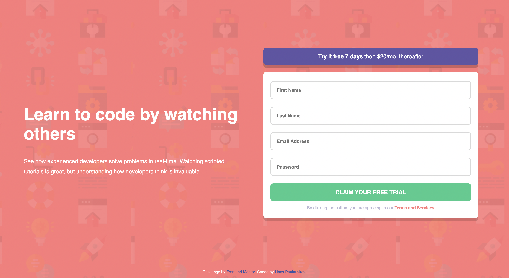

# Frontend Mentor - Intro component with sign up form solution

This is a solution to the [Intro component with sign up form challenge on Frontend Mentor](https://www.frontendmentor.io/challenges/intro-component-with-signup-form-5cf91bd49edda32581d28fd1). Frontend Mentor challenges help you improve your coding skills by building realistic projects. 

## Table of contents

- [Overview](#overview)
  - [The challenge](#the-challenge)
  - [Screenshot](#screenshot)
  - [Links](#links)
- [My process](#my-process)
  - [Built with](#built-with)
  - [What I learned](#what-i-learned)
  - [Continued development](#continued-development)
  - [Useful resources](#useful-resources)
- [Author](#author)

## Overview

### The challenge

Users should be able to:

- View the optimal layout for the site depending on their device's screen size
- See hover states for all interactive elements on the page
- Receive an error message when the `form` is submitted if:
  - Any `input` field is empty. The message for this error should say *"[Field Name] cannot be empty"*
  - The email address is not formatted correctly (i.e. a correct email address should have this structure: `name@host.tld`). The message for this error should say *"Looks like this is not an email"*

### Screenshot

### Links

- Solution URL: [Solution on FrontendMentor.io](https://www.frontendmentor.io/solutions/intro-signup-form-with-some-css-flexbox-yZT3aUgjC_)
- Live Site URL: [Live site on Netlify](https://intro-component-with-signup-form-master-linas.netlify.app/)

## My process

### Built with

- Semantic HTML5 markup
- CSS custom properties
- CSS Grid
- Mobile-first workflow

### What I learned

I have learnt to approach the design with mobile-first workflow mindset. This challenge was useful to tryout RegEx.

### Continued development

I will keep on challenging myself on Frontend Mentor. It is very good tool to see where you are lacking in knowledge.

### Useful resources

- [regexr](https://regexr.com/) - This helped me to define regex.
- [StackOverflow](https://stackoverflow.com/) - Well, this site doesn't need special introduction. 

## Author

- Frontend Mentor - [@paulauskas-linas](https://www.frontendmentor.io/profile/paulauskas-linas)

